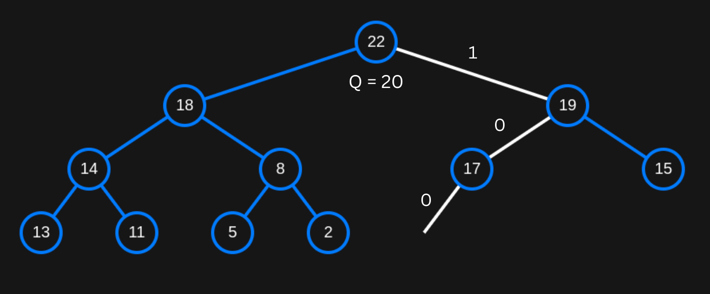

To make a the new heap implementation, we will use existing implementations and modify them.
We have two choices : 
1) Make array implementation work with fragmented memory
2) Make linked list implementation faster.

It is not possible to go with 1) as, the arrays need contigous block of memory, so we are left with 2), that is, make linked list implementation faster.

## Insertion

In a binary heap ( tree-node structure ), a new node is usually added as the left most child of the first available leaf node in order to maintain the complete binary tree property. 
Finding this position requires a level-order traversal (BFS), which takes O(n) time complexity, since we may need to examine all nodes to find the appropriate insertion point.

What if we can bring down the time complexity for finding the appropriate position ??

### Finding the path
Look at the following heap (binary tree structure / implementation)  :

(The pink numbers under each node represent `L` and `C` respectively    )

In order to maintain the complete binary tree property, the next element has to be inserted at position `P`, `L = 3` and `C = 4` **(`L` stands for level and `C` stands for column).** 
Upon closer inspection, we also find that, inorder to reach the position P, we have to go traverse from root in the following order 

`root -> right -> left -> left` i.e `Right, Left, Left` 

If I represent right as 1 and left as 0, then it would be `100` which is binary representation of `C` in `L` bits, i.e 4 in 3 bits.

This means **if** I know `C` and `L`, I can get to the appropriate position in O(log n), as I can simply traverse the path by checking every bit of `C` represented in binary in `L` bits. 
**This is true for all `C` and `L`.**

### Managing C and L
- `C` and `L` represent the path to the position where the **next** node is to be inserted.
- They **do not** represent the path to the position of the current right most leaf node in last level.
- We store `C` and `L` in root Node.
- So our root node is going to be different than the rest of the nodes, as it would have `L` and `C` along with `data`, `right` and `left` (data is the number stored in root node, right and left are the addresses of the left and right node).
- Initially when there is only root node, `L = 1` and `C = 0`.(`L = 1`, next node to be inserted will be level 1 and `C = 0`, it'll be to the left).
- Every time an element is inserted `C` is incremented, after incrementing `C`, if `C` is greater than 2L - 1, `C` is reset to 0 and `L` is incremented.

Example (Root is considered as the 0th element) :
- Initially `L = 1` and `C = 0` when there is only root node.
- For the 1st, `C` is incremented to 1 and since C <= 2L - 1 (1 <= 1) `L` remains same.
    + Result : `L = 1` , `C = 1`
- For the 2nd element `C` is incremented to 2 but C > 2L - 1 (2 > 1) so `L` is incremented and `L` remains same.
    + Result : `L  = 2` , `C = 0`
- For the 3rd element c is incremented, and since C <= 2L - 1 (0 <= 2) `L` remains the same.
    + Result : `L = 2` , `C = 1`

Now that we found the appropriate position, we can simply put the new element here, and bubble it up like we generally do in binary heap.

So that makes the complexity `O(log n) + O(log n)` [ `O(log n)` for finding the appropriate position and `O(log n)` for bubble up ]. 
In the classic heap implementation with binary tree structre, the time complexity would be `O(n) + O(log n)` [ `O(n)` for finding the appropriate position and `O(log n)` for bubble up ]

Can we make it better than `O(log n) + O(log n)` ?

### Push-Down
What if we perform `Push-Down` instead of the traditional `Bubble-Up` ? 

- Let the number we are going to insert be Q
- As we go down the path we generated using `C` and `L` we check if we can replace any number in this path is smaller than Q (for max heap) or larger than Q (for min heap), and then swap this number with Q.
- We continue going down the path and re-arrange the numbers in this manner.
- **In short**, we are treating Q as the parent node and comparing all the nodes along the path as child nodes and then performing appropriate swaps (heapification).

Example : 

Let Q be a node with the number 20. 
Since `C` and `L` are 4 and 3 respectively, the path is Right, left, left (`100` : `C` represented in binary as `L` bits)
- First we check if Q is larger than root.
In this case its not, so we continue down the path.

- We go `right : 1`, here 19 is smaller than 20, so both are swapped, Now Q is 19.

- We go `left : 0`, here 17 is smaller than 19, so both are swapped, Now Q is 17.
    + Here we can go right swap Q and 15, push Q down, but that would not satisfy full binary tree, following the path with C and L ensures full binary tree property.

 

- We go `left : 0`, insert the Q (17) here, as this is the last direction / bit.

 

Now we are performing `Push-Down` instead of `Bubble-Up`.

**Note** :

    Basically, we are performing heapification from top to bottom (`Push-Down`) instead of performing it from bottom to top (`Bubble up`) while carefully choosing certain nodes to rearrange in the tree, in such a manner that the tree holds the complete binary tree property.

    Here we treat the element to be inserted ( Q in the above example ) as the parent.

    While performing heapification from top to down, we will face two choices, when a parent node is smaller than both of its children (In max heap).
    We do not know which child to choose to swap with.
    We have to choose a child in such a manner that, full binary tree proprty is maintained.
    The decision of choosing the appropriate child is accomplished using `C` and `L`.

Since we are performing swapping/numbers (Heapify) simultaneously along with traversing the path, the new complexity is O(log n) instead of O(log n) + O(log n).

## Deletion
Number in root node is returned
Last number (Number in the left most leaf node) will be swapped with the number in the root node and the left most leaf node will be pruned.

    Step 0 : Return root->num 
    Step 1 : Find the number in right most leaf node in last level : O(n)
    Step 2 : Replace the number in root node with the number from the leaf node.
    Step 3 : Delete the leaf node.
    Step 3 : Heapify. (Starting from root). : O(log n)

    Total complexity = O(n) + O(log n)

### No-chain
We can get the O(n) in finding the right most leaf node in last level to O(log n) by using `L` and `C` as explained in the Insertion section.
Which makes the complexity to O(log n) + O(log n) [Finding + Heapify]

Before deletion of the node I update C and L as they represent the path to the position where the **next** node has to be inserted, to get the path for the last leaf 
After I delete the element I update the C to the next element  : 
1) Decrement C  `C--`    
2) if C == -1 : 
    Decrement L `L--`
    C = 2`L` - 1

This implementation uses same amount of memory as a traditional linked list implementation.(Except the root node, as it stores `L` and `C`). 
Implementation is not in main branch, its in `No-Chain` branch

Can we bring down the complexity of finding the right most leaf in last level node to O(1) from O(log n) ?

## Chain
Note : This implementation uses more memory per node than a traditional binary tree implementation (Stores one address in addition to a normal node).

We can chain/connect all the non-leaf nodes other than root with a linked list, where the head (Called as `Last Parent`) of the linked list is the parent of the last leaf node.
The address of `Last Parent` is stored in the root.

While inserting a new leaf node in Push-Down I pass through the parent node, in order to insert the new node. 
As I keep inserting elements, I chain these parents.

Example :

Here A, B, C ..... Z represent the nodes and not the numbers they hold. 

Here A is the root node. A->lastParent = NULL

&nbsp;&nbsp;&nbsp;&nbsp;&nbsp;&nbsp;&nbsp;

D is added to the tree. 
+ Now B is the last parent, so 
    1) B->nextParent = root->lastParent (which is NULL)
    2) root->lastParent = B

&nbsp;&nbsp;&nbsp;&nbsp;&nbsp;&nbsp;&nbsp;

E is added.

&nbsp;&nbsp;&nbsp;&nbsp;&nbsp;&nbsp;&nbsp;

F is added.
+ Now C is the last parent, so 
    1) C->nextParent = root->lastParent (which is B)
    2) root->lastParent = C

&nbsp;&nbsp;&nbsp;&nbsp;&nbsp;&nbsp;&nbsp;

G is added.

&nbsp;&nbsp;&nbsp;&nbsp;&nbsp;&nbsp;&nbsp;

H is added.
- Now D is the last parent, so 
    1) D->nextParent = root->lastParent (which is C)
    2) root->lastParent = D

&nbsp;&nbsp;&nbsp;&nbsp;&nbsp;&nbsp;&nbsp;

### Deletion
Since I have the address of the last parent, I can simply find the right most leaf node in the last level using `C`.

    if C & 1 == 1 :

        Node to delete = lastParent->right.  

    else :

        Node to delete = lastParent->left.

        // update lastParent
        root->lastParent = root->lastParent->nextParent

For example,
Here A,B,C..Z represent the nodes and the numbers they hold.
Current tree : A BC DEFG HIJ root->last parent = E, col = 2

Deleting right most leaf node in last level : 
since C & 1 == 0 
1) Delete lastParent->left which is J
2) 
3) C--

Deleting J
since `C & 1 == 0` delete lastParent->left i.e J
also `root->lastParent = root->lastParent->nextParent` which is `D`

Deleting I
since `C & 1 == 1` 

Now I can find the right most leaf node of last level with O(1) complexity. 
So deleting element complexity is O(1) + O(log n) [O(1) for swapping and O(logn) for heapify] which is the same complexity of deletion in array implementation.